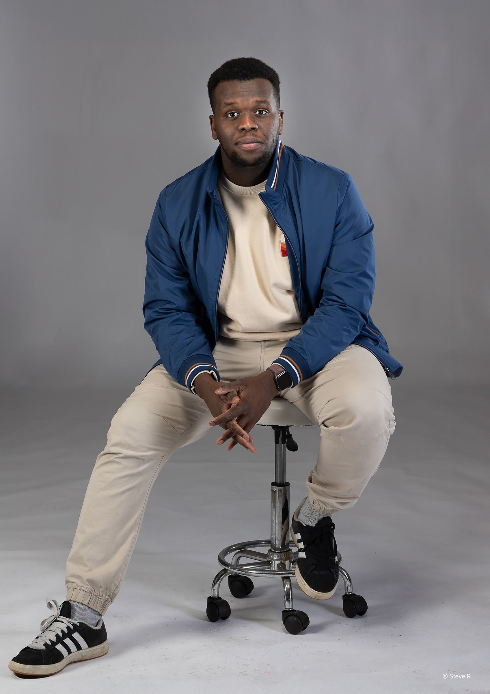

<head>
    <meta charset="UTF-8">
    <meta name="viewport" content="width=device-width, initial-scale=1.0">
    <title>About Me - Timeline</title>
    
    
    
    
</head>
<body class="bg-cream text-gray-800 font-sans antialiased">
    <!-- Hero Section -->
    <section class="pt-32 pb-16 px-6 max-w-6xl mx-auto">
        

            

                <!-- Portrait Image Left -->
                

                    

                        
                        

                    

                

                <!-- Text Content Right -->
                

                    

                        <i data-lucide="user" class="w-5 h-5"></i>
                        About Me
                    

                    <h1 class="text-4xl md:text-5xl font-bold text-gray-900 mb-6 leading-tight">
                        Hello, I'm Saifeldeen
                    </h1>
                    

                        I'm a creative developer and designer with a passion for building beautiful, functional experiences. 
                        This timeline represents my journey, skills, and the moments that shaped my career.
                    

                    

                        Developer
                        Designer
                        Creator
                    

                    

                        <a href="#timeline" class="inline-flex items-center gap-2 px-6 py-3 bg-terracotta text-white rounded-full hover:bg-terracotta/90 transition-all shadow-lg hover:shadow-xl transform hover:-translate-y-1">
                            Explore Timeline
                            <i data-lucide="arrow-down" class="w-4 h-4"></i>
                        </a>
                    

                

            

        

    </section>
    <!-- Timeline Section -->
    <section id="timeline" class="py-16 px-6 max-w-6xl mx-auto relative">
        

            <h2 class="text-3xl md:text-4xl font-bold text-gray-900 mb-4">My Journey</h2>
            

        

        

            <!-- Vertical Line -->
            

            <!-- Timeline Item 1: Landscape Image (Left text, Right image) -->
            

                

                

                    <!-- Text Side -->
                    

                        

                            2024 - Present
                            <h3 class="text-2xl font-bold text-gray-900 mt-2 mb-3">Senior Developer</h3>
                            

                                Leading development teams and architecting scalable solutions. 
                                Currently focused on full-stack applications and modern web technologies.
                            

                            

                                
                                
                                
                            

                        

                    

                    <!-- Image Side - Landscape -->
                    

                        

                            

                            
                            

                                <i data-lucide="briefcase" class="w-4 h-4 inline mr-1"></i>
                                Current Role
                            

                        

                    

                

            

            <!-- Timeline Item 2: Portrait Image (Left image, Right text) -->
            

                

                

                    <!-- Image Side - Portrait -->
                    

                        

                            

                            
                            

                                <i data-lucide="palette" class="w-4 h-4 inline mr-1"></i>
                                Design Phase
                            

                        

                    

                    <!-- Text Side -->
                    

                        

                            2022 - 2024
                            <h3 class="text-2xl font-bold text-gray-900 mt-2 mb-3">UI/UX Designer</h3>
                            

                                Transitioned into design, creating user-centered interfaces and design systems.
                                Collaborated with cross-functional teams to deliver exceptional user experiences.
                            

                            

                                
                                
                                
                            

                        

                    

                

            

            <!-- Timeline Item 3: Landscape Image (Left text, Right image) -->
            

                

                

                    <!-- Text Side -->
                    

                        

                            2020 - 2022
                            <h3 class="text-2xl font-bold text-gray-900 mt-2 mb-3">Frontend Developer</h3>
                            

                                Specialized in React and modern JavaScript frameworks. Built responsive,
                                accessible web applications for various clients and industries.
                            

                            

                                
                                
                                
                            

                        

                    

                    <!-- Image Side - Landscape -->
                    

                        

                            

                            
                            

                                <i data-lucide="code" class="w-4 h-4 inline mr-1"></i>
                                Development
                            

                        

                    

                

            

            # <!-- Timeline Item 4: Portrait Image (Left image, Right text) -->
            

                

                

                    <!-- Image Side - Portrait -->
                    

                        

                            

                            
                            

                                <i data-lucide="graduation-cap" class="w-4 h-4 inline mr-1"></i>
                                Learning
                            

                        

                    

                    <!-- Text Side -->
                    

                        

                            2018 - 2020
                            <h3 class="text-2xl font-bold text-gray-900 mt-2 mb-3">Computer Science Degree</h3>
                            

                                Earned my Bachelor's degree with honors. Focused on web technologies,
                                algorithms, and software engineering principles.
                            

                            

                                
                                
                                
                            

                        

                    

                

            

<!-- Timeline Item 5: Landscape Image &#40;Left text, Right image&#41; -->)
            

                

                

                    <!-- Text Side -->
                    

                        

                            2016 - 2018
                            <h3 class="text-2xl font-bold text-gray-900 mt-2 mb-3">First Code</h3>
                            

                                Wrote my first "Hello World" and fell in love with programming.
                                Started with HTML/CSS and quickly moved into JavaScript and beyond.
                            

                            

                                
                                
                                
                            

                        

                    

                    <!-- Image Side - Landscape -->
                    

                        

                            

                            
                            

                                <i data-lucide="rocket" class="w-4 h-4 inline mr-1"></i>
                                Beginning
                            

                        

                    

                

            

        

    </section>
    <!-- Footer -->
    <footer class="bg-white border-t-2 border-sage/30 mt-16 py-12 px-6">
        

            

                <a href="#" class="w-10 h-10 rounded-full bg-cream flex items-center justify-center text-terracotta hover:bg-terracotta hover:text-white transition-all">
                    <i data-lucide="github" class="w-5 h-5"></i>
                </a>
                <a href="#" class="w-10 h-10 rounded-full bg-cream flex items-center justify-center text-teal hover:bg-teal hover:text-white transition-all">
                    <i data-lucide="linkedin" class="w-5 h-5"></i>
                </a>
                <a href="#" class="w-10 h-10 rounded-full bg-cream flex items-center justify-center text-sage hover:bg-sage hover:text-white transition-all">
                    <i data-lucide="twitter" class="w-5 h-5"></i>
                </a>
                <a href="#" class="w-10 h-10 rounded-full bg-cream flex items-center justify-center text-terracotta hover:bg-terracotta hover:text-white transition-all">
                    <i data-lucide="mail" class="w-5 h-5"></i>
                </a>
            

            
&copy; 2024 Your Name. Built with passion and code.

        

    </footer>
    
</body>

